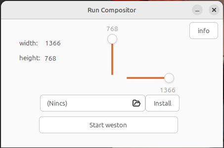

# Compositor Runner

Simple GTK3 application to start Weston compositor.Tested on Linux Mint 22 (Cinnamon 6.2.9, X11).
The app automatically launches Waydroid and the Weston compositor, and adjusts the screen size.
## Why I made this

Waydroid setup can be inconvenient when you need to manually start Weston and configure resolution.

This tool simplifies the process into a single click.

## Features

- Set width and height
- Start Weston

## Screenshot

## Build

g++ main.cpp -o program $(pkg-config gtkmm-3.0 --cflags --libs) -lX11

## Install

Download from Releases and install:

sudo dpkg -i compositor-runer.deb
